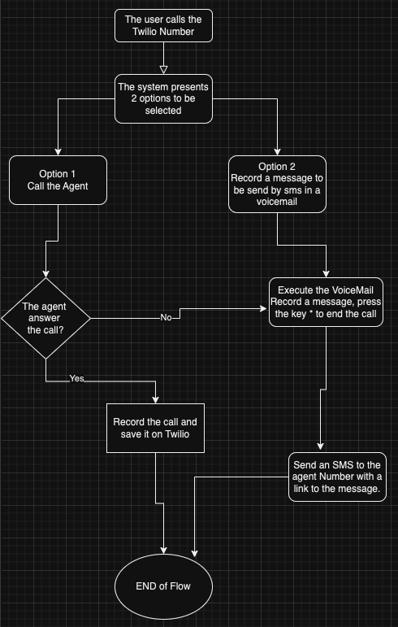
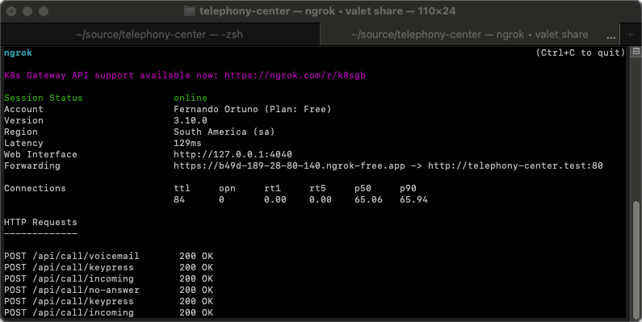
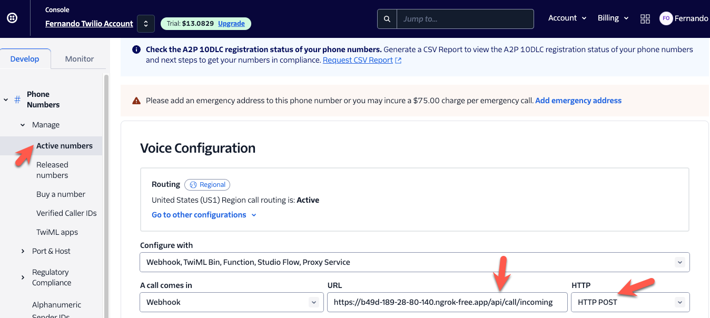

# Description

This project is a simplified VoIP phone application that works with Laravel and Twilio.

Laravel Version 8.1.

Twilio sdk Version 6.44.

The project follows the next structure:


The idea as described on the diagram is to allow The caller to choose between 2 options :
1.- Call the Agent.

2.- Leave a Voicemail to the agent.

If the user selects option 1, the endpoint will retrieve the TwiML for a call.

If the user selects option 2, the endpoint will retrieve the TwiML for a voicemail.

The VoiceMail allows Twilio to record a message, and later on, it sends an SMS to the agent number with a link to listen to the recorded message.
also if the agent doesn't answer the call or is busy with the call It triggers the scenario of executing the voicemail to the caller to allow to record a message to be delivered by SMS to the agent number.
## Demo
[demoTelephony-small.mp4](public/demoTelephony-small.mp4)

https://github.com/ortunoflores/telephony-center/assets/66982703/5ced7455-146d-47dc-bf00-599e5f3986aa


## Prerequisits

Before cloning/forking this project, make sure you have the following tools installed:

- [Git](https://git-scm.com/downloads)
- [PHP 8.2](https://www.php.net/downloads.php)
- [Laravel Valet](https://laravel.com/docs/11.x/valet)
- [Composer](https://getcomposer.org/) installed globally
- [Twilio account](https://www.twilio.com/try-twilio) you can sign up for a free trial account
- 3 phone numbers:
  - A Twilio phone number
  - A phone number to call the application
  - A phone number to act as the call center agent
- [Ngrok](https://ngrok.com/)


## Installation

1. Fork the project
2. Clone the project
3. Set the required environment variables on the .env
```
   TWILIO_ACCOUNT_SID=<<your_twilio_account_sid>>
   TWILIO_AUTH_TOKEN=<<your_twilio_account_auth_token>>
```

4. Install dependencies with composer
```
  composer install
```
5. Link and start the project with Laravel Valet
```
  valet start
```
this will create the project with his own domain.test, example: http://telephony-center.test 
6. Make the project publicly available on the internet
    With Valet we already have linked the funcionality of ngrok, it give us the option of execute the command on this way
```
cd projectName
valet share
```
After running that it will automatically generate the new ngrok link to be used on Twilio


If there is some problem with Ngrok this [Tutorial](https://laraveldev.pro/blog/3) is a good place to start. Also, check out the official [Documentation](https://ngrok.com/docs/getting-started/).

7. Configure the Twilio phone number
   First navigate to Phone **Numbers > Manage > Active Numbers**
   Click on the number you want to use. Then, in the Voice Configuration section:

   - Change the dropdown value of "A Call Comes In" to "Webhook"
   - Set your Ngrok Forwarding URL as the value of the "URL" field;
   - Ensure that the "HTTP" dropdown is set to "POST";
   - Click "Save configuration" at the bottom of the page

8. Test the Application
    Call the number of Twilio, and interact with the options provided on the flow.


## Endpoints Documentation
There is a postman collection with the 4 endpoints created on this project:
```
 POST  {{base_url}}/api/call/incoming
 POST  {{base_url}}/api/call/keypress
 POST  {{base_url}}/api/call/voicemail
 POST  {{base_url}}/api/call/no-answer
```
 You can find the detailed documentation here ->

[Awesome Endpoints/Postman Documentation](https://documenter.getpostman.com/view/28499739/2sA3QzZ7sM#d0c68681-773f-4e29-a535-d1bffa137bf9)


## Testing
The routes, the validator, and the referred to the endpoints funcionality is being tested, you can run
```
 php artisan test
```

To see all the suit of tests run with no errors.
